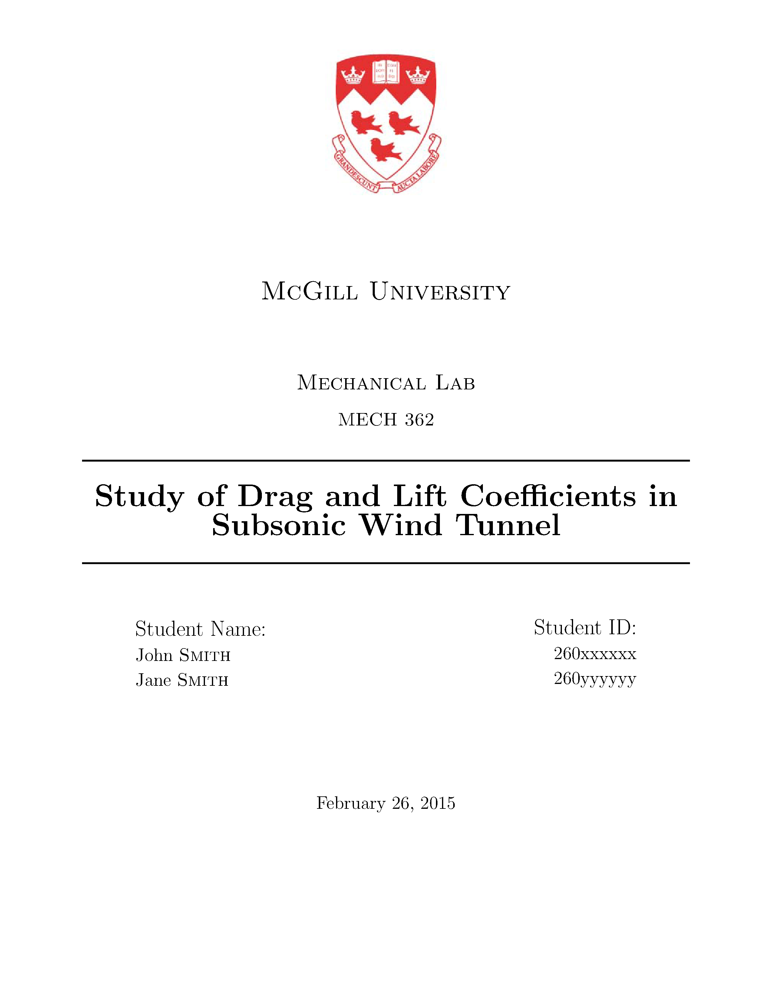
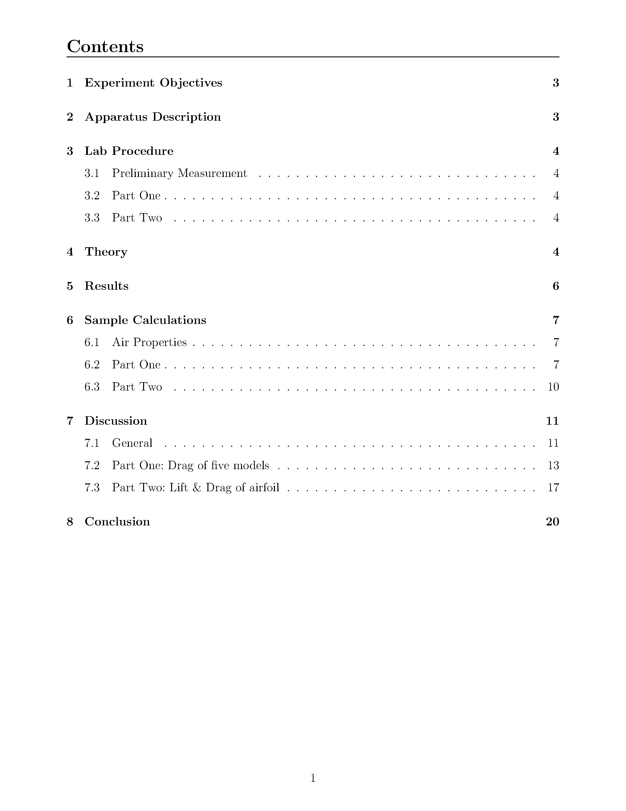
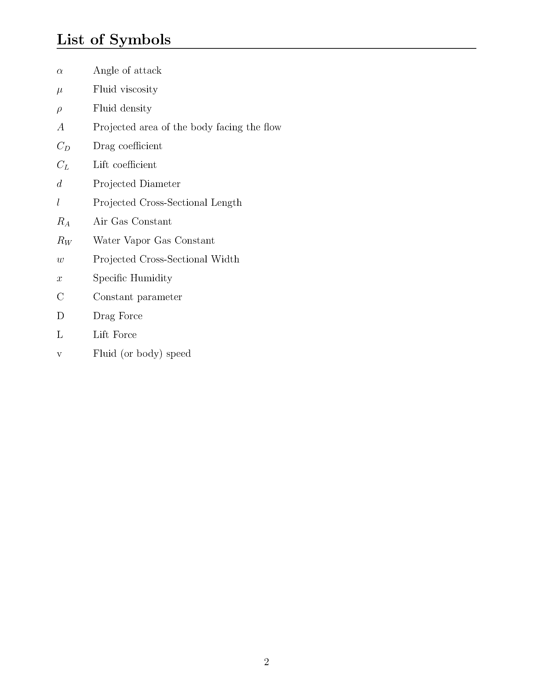
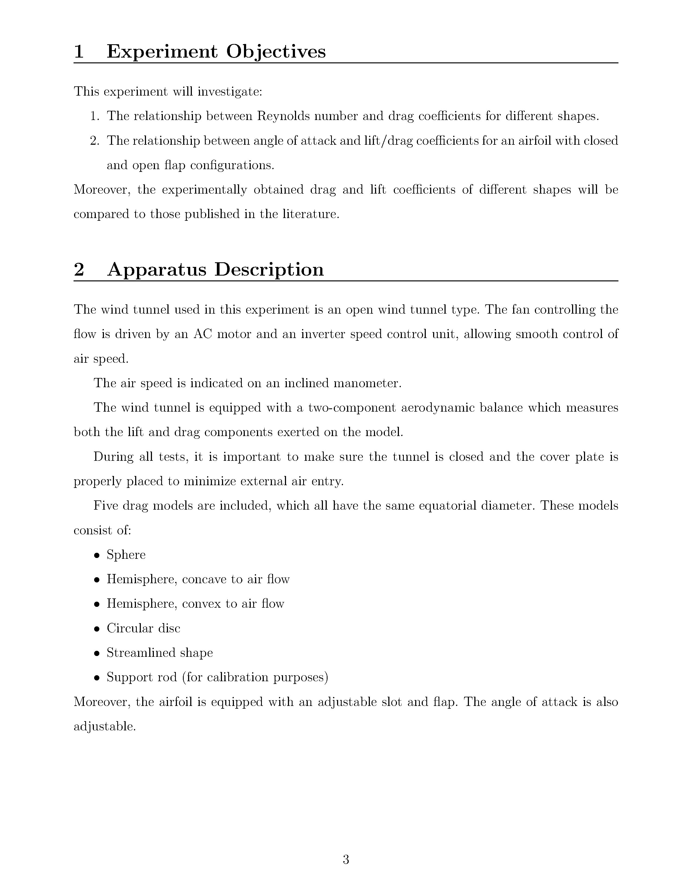

# cookiecutter-latex-article

A template for writing LaTeX documents. I myself mostly use this to write lab reports, essays and project reports for school. See https://github.com/audreyr/cookiecutter.

* Pretty Title Page: fields are automatically populated at project creation. 
* Nomenclature: Ready for nomenclature printing. *Make Index* script provided (see [Nomenclature](#nomenclature)).
* BibTeX: Set up to use BibTeX (IEEE style).
* Standard directory structure. 

See [Output](#output) for screenshots and sample PDF.

## Usage

Install *cookiecutter*:

    pip install cookiecutter

Generate a LaTeX project:

    cookiecutter https://github.com/kreger51/cookiecutter-latex-mcgill.git

Answer a few questions about the project information as well as if you need support for a Bibliography and/or Nomenclature, a.k.a list of symbols.

Start writing your document! Suggested use is to create new *.tex* file and include it using:

    \input{<file_name>.tex}

## Background

I am an engineering student at McGill University, hence the McGill logo and IEEE bibliography style.
I wrote the document class ``SelimArticle.cls`` because I always use more or less the same packages. 

*I am in no way affiliated with McGill University*

## Features
### Nomenclature

The [nomencl](http://cs.brown.edu/about/system/managed/latex/doc/nomencl.pdf)
package makes formatting a nomenclature a walk in the park. 

**Basic Usage:**
* Add symbols to list of symbols using ``\nomenclature`` command (see documentation).
* Assuming you answered positively to the ``nomenclature`` question during setup, run provided ``makeidx.bat`` from command prompt (Windows). 
* Build ``main.tex`` once or twice.

If you're on a non-Windows platform, simply replacing the ``.bat`` extension to ``.sh`` should work.

### BibTeX

An empty ``dabib.bib`` file is included with the template if you answer positively to ``bibtex``. Bibliography style and insertion at the bottom of ``main.tex``.

### Title Page

Title page formatting is done in ``mypage.sty`` package, and parameters such as student ID, name, course name etc... can easily be modified in ``options.tex``.

**Logo:**
The McGill logo is taken from ``logo.jpg``. To change the logo, replace the file with your own.

### Document Class

I use my own document class (``SelimArticle.cls``), which loads the default *article* document class. The only option proper to this custom class is [Nomencl], which loads necessary packages and adjusts formatting for the list of symbols. 

**Additional options are passed to the *article* document class**

### Directory Structure

I like to keep my figures in a separate folder (in this case "figs") and my ``.tex`` files in the same directory as the main. I also like to have my LaTeX files in a subdirectory (in this case "tex") and keep related documents, e.g. an Excel workbook, IPython Notebook or project instructions, in the project's root directory.

## Not Exactly What You Want?

### Similar Cookiecutter Templates

No similar templates yet.

### Fork This and Create Your Own

If you have differences in your preferred setup, I encourage you to fork this and make the desired modifications. 

* Once you have your own version working, add it to the Similar Cookiecutter
  Templates list above with a brief description.

* It's up to you whether or not to rename your fork/own version. Do whatever
  you think sounds good.

### Pull Request

I accept suggestions/pull requests. 

# Output

[Sample PDF](bin/example.pdf)

**Screenshots:**

